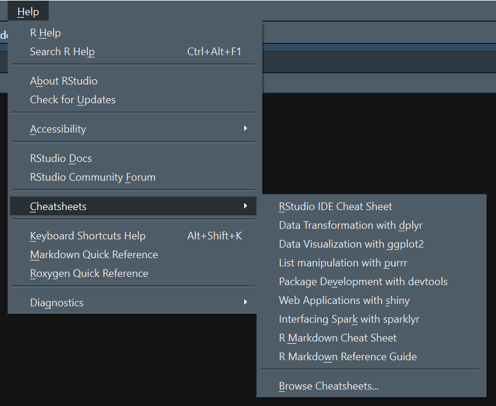
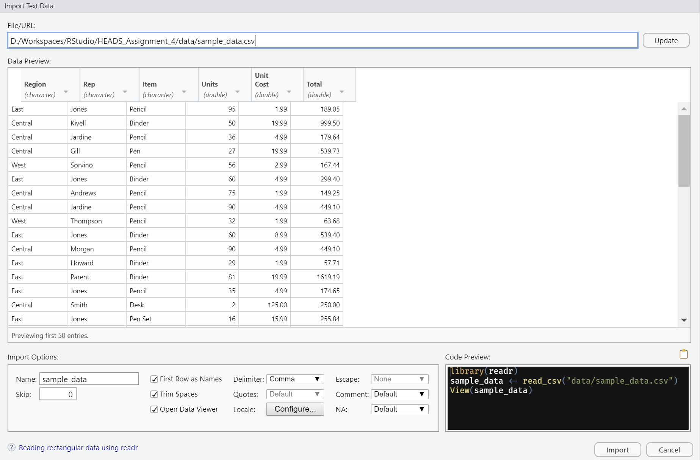

<!-- README.md is generated from README.Rmd. Please edit that file -->

```{r setup, include = FALSE}
knitr::opts_chunk$set(
  fig.path = ".assets/figures/README-",
  echo = TRUE,
  message = FALSE,
  warning = FALSE,
  collapse = TRUE
)
```


<!-- start badges -->

<a href="https://mybinder.org/v2/gh/HEADS-UPorto/Rstudio_Env/main?urlpath=git-pull%3Frepo%3Dhttps%253A%252F%252Fgithub.com%252FHEADS-UPorto%252F${{env.REPOSITORY_SLUG}}%26targetPath%3Dheads%26urlpath%3Drstudio%252F%26branch%3Dmaster"></a>


<!-- end badges -->

## Syllabus

This module will cover:

-   Introduction to Functions
-   Introduction to [Data Wrangling](https://en.wikipedia.org/wiki/Data_wrangling)

## Lessons

### Module 4.1: Functions

You may think of Functions as a way to have a piece of code that can be used several times instead of having that code copied around your script.
Usually functions have a very specific task and the conjugation of several function is what make them powerful.

Functions are created using the `function()` directive, and they are stored (as you may remember from the first module: "everything in R is an object") as an Object of class "function".

Example:

``` r
my_function <- function(first_argument, second_argument, ...) {

## do stuffs here

}

# call the function and stores the result in a variable
result <- my_function("argument", 2.0)
```

Here are some features a function has while being an object:

-   You can pass a function as a parameter to another function
-   You can create functions inside a function
-   Functions can create another function (return a new function as a result)
-   Functions can also re-write itself (advanced features, just for curiosity)

#### Basic concepts of a function

A function has some basic concepts you must know:

-   Name: this is just the name of the object where the function is stored. This means you can change its name. This is important because in some cases you may use the "string" name to call a function (advanced stuff).
-   Arguments: this is how you talk to the function. They are the input values you send to the function work with do what it is supposed to do.
-   Returning value: functions can return a value (more precisely an object), but they can also return nothing. In R the last evaluated expression is automatically returned, but you can also use the `return()` directive to be more explicit, or exit the function earlier.

#### More about arguments

A function may have named arguments with or without a default value:

```{r function}
# the argument `c` has a default value of `2`
my_function <- function(a, b, c = 2) {
  # do stuff
  cat(a)
}
```

Arguments can be used in order, or explicitly using their names:

```{r using, collapse=TRUE}
# argument `c` has a default value of `2`, so I can omit it
my_function(1, b = 10)
```

> *PS: it is not good practice to change the order of the arguments just because you can assign them by name.*

Arguments can also be *missing* and (if there is no default value) any attempt to use that argument inside the function will return an error.

```{r error, error=TRUE}
my_function()
```

Finally, there is an special argument called `ellipsis` that is represented with `...`.

Let's take a look:

``` r
my_special_function <- function(..., data = NULL, verbose = FALSE) {
  # special things happens
}
```

How to use `ellipsis` inside a function is an advanced topic.
Now we will only learn how to use a function that as `ellipsis` as argument.

The function above tells us that you can add multiple arguments before `data` (that has a default value).

So we can call this function the following ways:

``` r
# this will pass all arguments to the function and leave `data` and
# `verbose` with their default values
my_special_function("text", 1, some_variable)

# this will pass two arguments to the function, and set `data` with a variable.
my_special_function("text", 1, data = my_data)

# this will pass no argument but set `data` with another value.
my_special_function(data = my_data)
```

**IMPORTANT:** the arguments after an `ellipsis` must be set using their names, otherwise the values will be passed through the `ellipsis`.

### Module 4.2: Data Wrangling

#### Introduction to [tidyverse](https://www.tidyverse.org/)

Tidyverse is a collection of packages designed for Data Science.
All packages follow the same grammar and data structure, so you can use them in your workflow easily.

The main packages are (imho):

-   **dplyr** - data manipulation: filter, select, sort, summarize data.

-   **tidyr** - helps you create tidy data.
    Tidy data is data where:

    -   Every column is variable.
    -   Every row is an observation.
    -   Every cell is a single value.

-   **readr** - easy way to import several data formats into data frames.

-   **ggplot2** - a system for declaratively creating graphics, based on [The Grammar of Graphics](https://amzn.to/2ef1eWp).

And the other principal packages are:

-   **forcats** - provides a suite of useful tools that solve common problems with factors.
-   **stringr** - provides a cohesive set of functions designed to make working with strings as easy as possible.
-   **tibble** - is a modern re-imagining of the data frame, keeping what time has proven to be effective, and throwing out what it has not.
-   **purrr** - enhances R's functional programming (FP) toolkit by providing a complete and consistent set of tools for working with functions and vectors.

All the packages above are called the *Core tidyverse*.
Other packages can be found [here](https://www.tidyverse.org/packages/).

Furthermore, tidyverse packages has a nice handout for every package, called "cheatsheets".
You can find the last version easily on RStudio: Help ➝ Cheatsheets.

<center>

</center>

In the future we will also cover the [tidymodels](https://www.tidymodels.org/).

#### Starting with readr

Doesn't R have a functions to import data yet?
Sure it does, and these functions are inside the `utils` package that comes already with R.
So why bother with another package?
Consistency.

From the [official website](https://readr.tidyverse.org/):

> Compared to the corresponding base functions, `readr` functions:
>
> -   Use a consistent naming scheme for the parameters (e.g. `col_names` and `col_types` not `header` and `colClasses`).
> -   Are much faster (up to 10x).
> -   Leave strings as is by default, and automatically parse common date/time formats.
> -   Have a helpful progress bar if loading is going to take a while.
> -   All functions work exactly the same way regardless of the current locale. To override the US-centric defaults, use `locale()`.

Let's start with examples:

```{r first_read}
# if you dont have it yet, install readr
# install.packages("readr")
library(readr)

sample_data <- read_csv("data/sample_data.csv")

# check this:
sample_data
```

Hey!
Look again.
What is that `A tibble: 43 x 6` ?
Is this not a `data.frame`?
Yes, it is, but not only.

Above we've seen a package called `tibble`, what it does?

Again, from [the source](https://tibble.tidyverse.org/):

> Tibbles are `data.frames` that are lazy and surly: they do less (i.e. they don't change variable names or types, and don't do partial matching) and complain more (e.g. when a variable does not exist).
> This forces you to confront problems earlier, typically leading to cleaner, more expressive code.
> Tibbles also have an enhanced `print()` method which makes them easier to use with large datasets containing complex objects.

That's why when we wrote the variable number we didn't get a huge table printed in our screen, because `tibble` prints only the necessary.

Just for sanity-check, lets see the class of this imported data:

```{r data_class}
class(sample_data)
```

This is a nice opportunity to see what is called inheritance in another languages.
This is indeed a `data.frame`, but is also a `tbl`, a `tbl_df` and finally `spec_tbl_df` that is first class to be used by further functions (although it was the last class to be added to this object).

Getting back to examples, we can import other formats besides `.csv`:

```{r import_excel}
# if you dont have it yet, install readr
# install.packages("readr")
library(readr)

sample_data <- read_tsv("data/sample_data.tsv")

# if you dont have it yet, install readr
# install.packages("readxl")
library(readxl)
sample_data <- read_excel("data/sample_data.xlsx")
```

Here we see another package, `readxl` that comes also from the Tidyverse ecosystem ([more...](https://readxl.tidyverse.org/))

This is the basic usage.
But we can set several options to import the data correctly when there are formatting issues, or we use another symbol as NA or missing, for example.

To help us make this easy, RStudio has a nice interface for it, let's try:

1.  Navigate to the `data` folder, you'll see three files named `sample_data`.
2.  Click with the left mouse button over the `sample_data.csv` and choose "Import Dataset"

Now you will see a window like this:

<center>

</center>

This tutorial will not cover these options.
Feel free to explore.

#### Basic data manipulation with dplyr

Most common data manipulation are easy to do with dplyr.
Those manipulation that seems hard to do, believe, there is a way.

We will cover these basic functions for now:

-   `filter()`: returns the lines of dataset that matches a condition.
-   `select()`: returns the columns of dataset that matches a condition.
-   `mutate()`: adds new variables based on existing ones.
-   `arrange()`: changes the ordering of rows.

Using `filter()` :

```{r filter}
# if you dont have it yet, install dplyr
# install.packages("dplyr")
library(dplyr)

# let's use our previous dataset: `sample_data`
filtered_data <- filter(sample_data, Item == "Pencil")

filtered_data
```

```{r multi_filter}
# filter using more than one condition
filtered_data <- filter(sample_data, Item == "Pencil", Region == "East")

filtered_data
```

Using `select()` :

```{r select}
# if you dont have it yet, install dplyr
# install.packages("dplyr")
library(dplyr)

# select two columns
selected_data <- select(sample_data, Region, Item)

selected_data
```

```{r other_select}
# select a range of columns
selected_data <- select(sample_data, Region:Item)

selected_data
```

Using `mutate()` :

```{r mutate}
# if you dont have it yet, install dplyr
# install.packages("dplyr")
library(dplyr)

# create a new column called `Hundred_cost` using `Unit Cost` as origin
mutated_data <- mutate(sample_data, Hundred_cost = `Unit Cost` * 100)

mutated_data
```

> **ATTENTION:** If you use the name of an existing column, dplyr will not create a copy, but will overwrite the original with new data.

Using `arrange()` :

```{r arrange}
# if you dont have it yet, install dplyr
# install.packages("dplyr")
library(dplyr)

# Sort by Region and then by Rep descending order
arranged_data <- arrange(sample_data, Region, desc(Rep))

arranged_data
```

Using all at once (**check this example!**):

```{r all_dplyr}
# if you dont have it yet, install dplyr
# install.packages("dplyr")
library(dplyr)

# Here we will use a tool called "pipe". This tool allows us to write a more
# readable code. It works like if our data is passing through several steps
# instead of recording the output of a function to use it again in another function.

# ugly way:
filtered_data <- filter(sample_data, Item == "Pencil")
selected_data <- select(filtered_data, Region:Item, `Unit Cost`)
mutated_data <- mutate(selected_data, Hundred_cost = `Unit Cost` * 100)
arranged_data <- arrange(mutated_data, Region, desc(Rep))

# insane way:
arranged_data <- arrange(
                   mutate(
                     select(
                       filter(
                         sample_data, Item == "Pencil"
                       ), Region:Item, `Unit Cost`
                     ), Hundred_cost = `Unit Cost` * 100
                   ), Region, desc(Rep)
                 )

# right way (you ommit the first argument since it comes from the previous step):
arranged_data <- sample_data %>% filter(Item == "Pencil") %>%
                   select(Region:Item, `Unit Cost`) %>%
                   mutate(Hundred_cost = `Unit Cost` * 100) %>%
                   arrange(Region, desc(Rep))

arranged_data
```

This covers the basics.
We will see more examples in the next class.

### Module 4.3: Write a simple R code

Your fourth task will be:

1.  Open the file `assignment.R` that is already in the project, and start from there.
2.  Complete the code following the instructions in the comments
